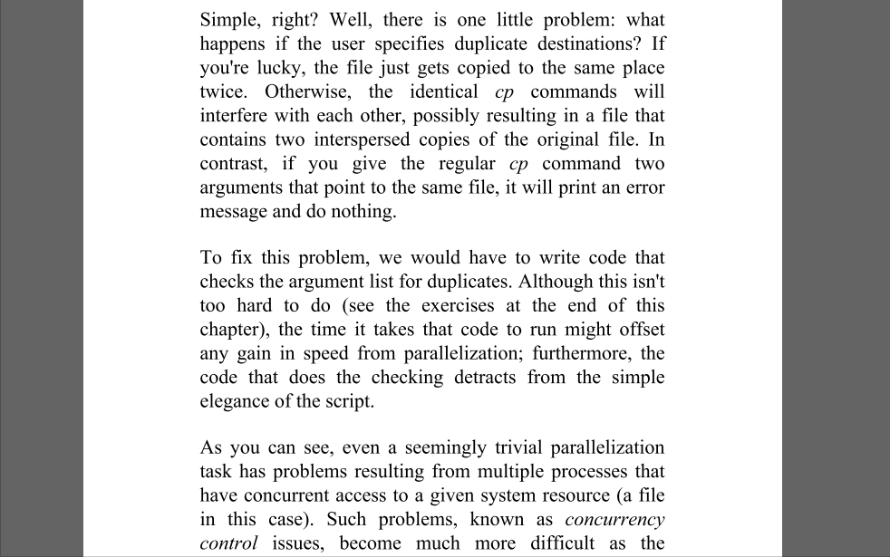

## 剪切板翻译工具 Clipboard Translator

## 为什么要做这个工具？

虽然有道词典和很多 Chrome 拓展都有划词翻译的功能，但是在 Windows 平板模式上看 PDF 文件时划词翻译就不好用了，因为这时候没有鼠标。而 PDF 阅读器往往提供了点词复制的功能，比如：xodo。所以萌生了做一款复制翻译的小工具的想法。

效果如上图所示，需要注意的是通过爬有道词典网页版获取翻译内容的，所以有两点需要注意：

1. 翻译频率太高可能会被封（正常频率不会发生）；

2. 另外也有可能因为有道网站改版的原因会导致失效（这个我会及时更新）。